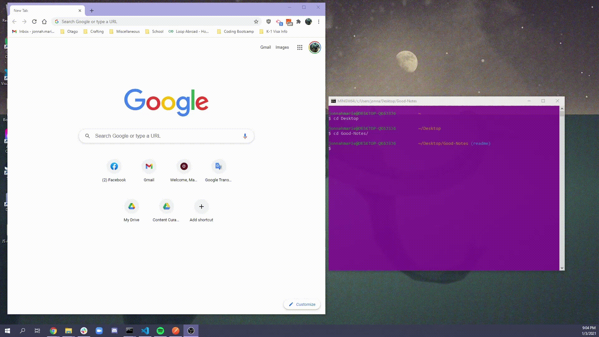

# The "Good Notes" Taker

## Description
This is an application that enables a user to create and save notes AND view and delete those saved notes. This project made use of the Node.js and Express.js in the backend to support a pre-built frontend application.

## Installation

### From your local machine
- Clone the repository, then in order to run, install the dependencies by typing in your terminal:
```
npm install
```
Then run the server by:
```
node server.js
```
In your web browser, search for:
```
localhost:8080
```

### From the deployed web application
No installation is necessary. Please access the deployed app by visiting: [https://polar-ravine-14945.herokuapp.com/](https://polar-ravine-14945.herokuapp.com/)

## Usage
To view a video demo, click [here](https://drive.google.com/file/d/19FEeXbWjLvYpVwiwg9EiNIf1voZzdK3N/view?usp=sharing).



## License
 MIT License

Copyright (c) 2021 Jonnah Marie Pangilinan

Permission is hereby granted, free of charge, to any person obtaining a copy
of this software and associated documentation files (the "Software"), to deal
in the Software without restriction, including without limitation the rights
to use, copy, modify, merge, publish, distribute, sublicense, and/or sell
copies of the Software, and to permit persons to whom the Software is
furnished to do so, subject to the following conditions:

The above copyright notice and this permission notice shall be included in all
copies or substantial portions of the Software.

THE SOFTWARE IS PROVIDED "AS IS", WITHOUT WARRANTY OF ANY KIND, EXPRESS OR
IMPLIED, INCLUDING BUT NOT LIMITED TO THE WARRANTIES OF MERCHANTABILITY,
FITNESS FOR A PARTICULAR PURPOSE AND NONINFRINGEMENT. IN NO EVENT SHALL THE
AUTHORS OR COPYRIGHT HOLDERS BE LIABLE FOR ANY CLAIM, DAMAGES OR OTHER
LIABILITY, WHETHER IN AN ACTION OF CONTRACT, TORT OR OTHERWISE, ARISING FROM,
OUT OF OR IN CONNECTION WITH THE SOFTWARE OR THE USE OR OTHER DEALINGS IN THE
SOFTWARE.